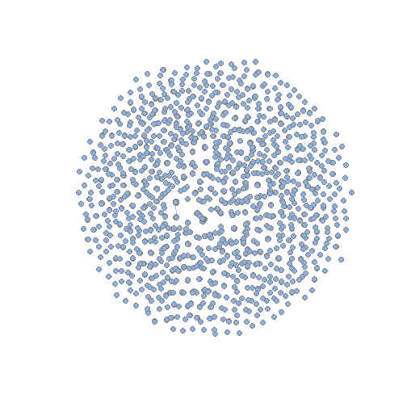
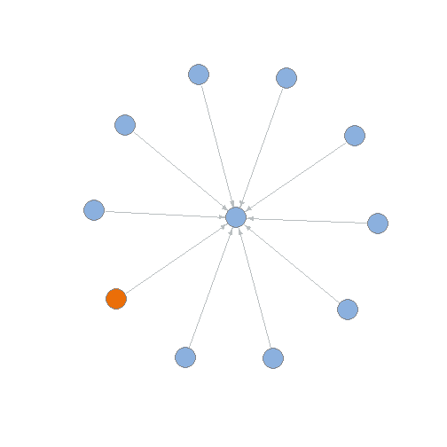
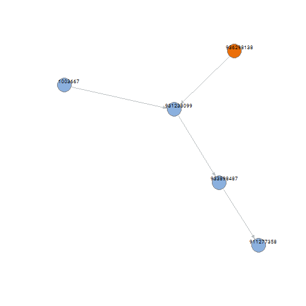

* [Introduction](#introduction)
    - [Example data](#example_data)
* [Creating a company hierarchy graph](#create_hierachy_graph)
* [Selecting company hierarchies graphs](#selecting)
    - [Selecting a hierarchy by company ID](#selecting_single)
    - [Selecting hierarchies with a column of company IDs](#selecting_multiple)
    - [Selecting company neighbourhoods with a column of company IDs](#selecting_ego_graphs)
    - [Listing all hierarchy graphs](#selecting_all)
* [Converting company hierarchy graphs to data-frames](#selecting)
    - [Converting a single hierarchy graph](#selecting_single)
    - [Converting a list of hierarchy graphs](#selecting_multiple)
* [Calculating properties](#calculate)
    - [Summing values](#summing_values)
    - [Propagating values](#propagate_values)
    - [Adding graph statistics](#adding_stats)
    - [Marking companies](#marking)
    - [Sister companies](#sister_companies)
    - [Recoding holdings](#recode_holdings)


# Introduction

In our database we can find the relations between companies by a parent child relation, but there is a lot of information that can be gained from the total total tree of company relations. This package contains several functions that is useful for extracting this kind of information, and for plotting the total company hierarchy.

### <a name="example_data"></a>The example data

First let's load the package:

```r
library(graydon.package)
```

The package contains a data frame, _tbl_company_relations_ which is an ex(s)ample of how company relations are typically represented in our database (_id_company_, _id_company_parent_), with some extra added data about each of the companies. The data frame contains the following columns:

|Column.names      |
|:-----------------|
|id_company        |
|id_company_parent |
|code_sbi          |
|size_company      |
|qty_employees     |
# <a name="create_hierachy_graph"></a>Creating a company hierarchy graph

Company relations in our database are represented in parent-child relations, but this doesn't give you the complete overview of how companies fit together in their complete hierarchy.  [Graphs](https://en.wikipedia.org/wiki/Graph_(discrete_mathematics) provide a way of getting those overviews. Let's load the [_igraph_](http://igraph.org/r/doc/) library first:

```r
library(igraph)
```

With a simple function call we can create a graph, based on those parent-child relationships expressed in a table. Make sure the child and the parent ID columns are the first and second column in the table respectively.

```r
graph_company_hierarchies <- create_graph_company_hierarchies(tbl_company_relations)
```
The resulting graph represents a network of all individual company hierarchies in one big 'space' which can be graphically represented like below. You can see this plot is pretty useless in in itself, but this 'space' of hierarchies can be used as a 'database' to easily retrieve the desired company hierarchies which are usefull for plotting and doing calculations within those.

The _plot_graydon_graph_ function is used to plot graphs using graydon colors, the extra parameters _vertex.label_, _vertex.size_ and _edge.arrow.size_ are set so they override the defaults.

```r
plot_graydon_graph(graph_company_hierarchies,
                   vertex.label = "",
                   vertex.size = 4,
                   edge.arrow.size = 0)
```



# <a name="selecting"></a>Selecting company hierarchies graphs

There are a few ways which we can select the distinct company hierarchies so we can make useful calculations or plots about them: you can either select them individually or by bulk.

## <a name="selecting_single"></a>Selecting a hierarchy by company ID

If you have a single company that you want to find out about more you can select it using the function _find_company_hierarchy_:

```r
id_company_selected <- "931238099"
graph_company_hierarchy <- find_company_hierarchy(graph_company_hierarchies, id_company_selected)
```

The resulting graph has the logical attribute _is_searched_company_ set to _TRUE_ of the searched for company. Let's plot this graph, highlighting the searched for companies:

```r
igraph::V(graph_company_hierarchy)$color <- ifelse(igraph::V(graph_company_hierarchy)$is_searched_company,
                                                   col_graydon[2],
                                                   col_graydon[4])
plot_graydon_graph(graph_company_hierarchy)
```


## <a name="selecting_multiple"></a>Selecting hierarchies with a column of company IDs

A customer's file contains multiple companies of which we might want to calculate, or show (parts) of their hierarchy. The _list_selected_hierarchies_ function can be used to put the graphs of all these companies in a list. In this example we have a data frame _tbl_customers_ with the column _id_company_, of which we want to retrieve all the graphs. 


```r
list_selected_hierarchies <- select_graph_hierarchies(graph_company_hierarchies, 
                                                      tbl_customers$id_company)
```

Note that the _tbl_customers_ data-frame contains 300, while the _list_selected_hierarchies_ contains 249 graphs; this is because there are customers that fall within the same company hierarchy. The companies in the graphs in this list now also contain an extra logical attribute, _is_searched_company_, which indicates whether the company was in the _id_company_ column. Let's take a look at one of the graphs that contain multiple customers. The customer 'vertices' are colored orange here:

```r
igraph::V(graph_example)$color <- ifelse(igraph::V(graph_example)$is_searched_company,
                                                   col_graydon[2],
                                                   col_graydon[4])
plot_graydon_graph(graph_example, vertex.label = "")
```



## <a name="selecting_ego_graphs"></a>Selecting company neighbourhoods

You can also select parts of company hierarchies by selecting it's neighbourhood. These kinds of graphs are called [Neighborhood- or Ego graphs](https://en.wikipedia.org/wiki/Neighbourhood_(graph_theory)). You can find the neighbourhood of companies with the function _select_ego_graphs_. In this example we are looking for two ego graphs, where are neighbourhood is defined as being two steps away as a maximum (set by the function argument _distance_, where it's default is 1), and we want only the companies (grand)children (as set by the argument _only_children_, which default value is FALSE). Both requested company ID's come from the same company hierarchy, but result in two ego graph's nonetheless. 

```r
lst_results <- select_ego_graphs(graph_company_hierarchies, 
                                 id_companies = c("169072", "910716048"), 
                                 distance = 2, 
                                 only_children = TRUE)
```


## <a name="selecting_all"></a>Listing all hierarchy graphs

For whatever reason, you might want to creating a list of all of the seperate company hierarchies out of the complete company hierarchy 'space'. This will take some time, so take some coffee....    

```r
list_all_graphs <- list_company_hierarchy_graphs(graph_company_hierarchies)
```

# <a name="convert_graph"></a>Converting company hierarchy graphs to data-frames 

Having graphs is nice for creating beautiful plots and useful calculations, but for the data to be useful for further processing, getting data from the graph into a data-frame format is handy.

## <a name="convert_single_graph"></a>Converting a single hierarchy graph

To turn a graph into a data-frame youy can use the function _hierarchy_as_data_frame_. We created the graph _graph_company_hierarchy_ by searching hierarchies by company IDs and set the colors to them being in the searched-for companies, this is reflected by the _graph_company_hierarchy_ and _color_ columns respectively.

```r
df_single_hierarchy <- hierarchy_as_data_frame(graph_company_hierarchy)
```

|name      | id_company_parent|code_sbi | size_company| qty_employees|is_searched_company |color   |
|:---------|-----------------:|:--------|------------:|-------------:|:-------------------|:-------|
|1003667   |         931238099|7022     |            2|            15|FALSE               |#8BB0DE |
|931238099 |         933898487|6420     |            1|             0|TRUE                |#EB6E08 |
|933898487 |         911277358|7022     |            1|             0|FALSE               |#8BB0DE |
|936298138 |         931238099|7311     |            2|             2|FALSE               |#8BB0DE |
|911277358 |                NA|6420     |            2|             1|FALSE               |#8BB0DE |

## <a name="convert_list_graphs"></a>Converting a list of hierarchy graphs

A list of graphs can also be converted into a data-frame using _hierarchy_list_as_data_frame_:

```r
df_selected_hierarchies <- hierarchy_list_as_data_frame(list_selected_hierarchies)
```


# <a name="calculate"></a>Calculating properties

## <a name="summing_values"></a>Summing values

Totalling values from across the network can sometimes come in handy for further calculations. You can use the function _total_hierarchy_value_ in combination with aggregation functions like _sum_, _mean_, _min_ or _median_ for this

```r
graph_company_hierarchy <- total_hierarchy_value(graph_company_hierarchy, 
                                                 name_attribute = "qty_employees", name_total = "qty_employees_sum", 
                                                 FUN = sum, na.rm = TRUE)
```
The result can be found can be shown in a graph, where we can see the original values and the totalled values.

```r
igraph::V(graph_company_hierarchy)$label <- paste0("# ",
                                                   igraph::V(graph_company_hierarchy)$qty_employees,
                                                   " -> Sum # ",
                                                   igraph::V(graph_company_hierarchy)$qty_employees_sum)

plot_graydon_graph(graph_company_hierarchy)
```


## <a name="propage_values"></a>Propagating values

It might come in handy to cumulate values in the hierarchy bottom up; this is where the _aggregate_company_hierarchy_value_ function comes in handy. In this example the companies will get a new attribute _qty_employees_cum_ which will contain the sum of all the _qty_employees_ of the companies that below the company within the hierarchy.

```r
graph_company_hierarchy <- 
  aggregate_hierarchy_value(graph = graph_company_hierarchy, 
                            name_attribute = "qty_employees",
                            name_aggregate = "qty_employees_cum",
                            FUN = sum, 
                            na.rm = TRUE)
```
The result can be found can be shown in a graph, where we can see the original values and the rolled up values.

```r
igraph::V(graph_company_hierarchy)$label <- paste0("# ",
                                                   igraph::V(graph_company_hierarchy)$qty_employees,
                                                   " -> Cum # ",
                                                   igraph::V(graph_company_hierarchy)$qty_employees_cum)

plot_graydon_graph(graph_company_hierarchy)
```


## <a name="adding_stats"></a>Adding graph statistics

Some overall statistics about the hierarchy can be added to the individual companies by using the _add_company_hierarchy_stats_ function. This function will add the following attributes
* _is_tree_ - A logical indicating whether the company hierarchy is a tree (which should always be the case).
* _qty_comapny_hierarchy_ - The the number of companies in the hierarchy.
* _id_company_top_ - The company ID of the highest company in the hierachy (ultimate mother).
* _distance_to_top_ - The number of companies between the current company and the ultimate mother company
* _qty_child_companies_ - The number of child companies.
* _qty_sister_companies_ - The number of sibling companies.


```r
graph_company_hierarchy <- add_company_hierarchy_stats(graph_company_hierarchy)
```
Let's look at the statistics:

```r
df_single_hierarchy <- hierarchy_as_data_frame(graph_company_hierarchy)
```

|name      | id_company_parent|code_sbi | size_company| qty_employees|is_searched_company | qty_employees_sum| qty_employees_cum|is_tree | qty_hierarchy_companies|id_company_top | distance_to_top| qty_child_companies| qty_sister_companies|
|:---------|-----------------:|:--------|------------:|-------------:|:-------------------|-----------------:|-----------------:|:-------|-----------------------:|:--------------|---------------:|-------------------:|--------------------:|
|1003667   |         931238099|7022     |            2|            15|FALSE               |                18|                15|TRUE    |                       5|911277358      |               3|                   0|                    2|
|931238099 |         933898487|6420     |            1|             0|TRUE                |                18|                17|TRUE    |                       5|911277358      |               2|                   2|                    1|
|933898487 |         911277358|7022     |            1|             0|FALSE               |                18|                17|TRUE    |                       5|911277358      |               1|                   1|                    1|
|936298138 |         931238099|7311     |            2|             2|FALSE               |                18|                 2|TRUE    |                       5|911277358      |               3|                   0|                    2|
|911277358 |                NA|6420     |            2|             1|FALSE               |                18|                18|TRUE    |                       5|911277358      |               0|                   1|                    0|

## <a name="marking"></a>Marking companies

You can mark companies within a graphthat meet certain categorical  criteria with the function _mark_companies_logical_. This can be useful for derivations or coloring graphs. As a somewhat travial  example, let's mark the companies that have SBI codes (from _code_sbi_) that are a associated with holdings (that are in the vector _vec_sbi_holdings_). The new company attribute name will be _is_holding_.

```r
vec_sbi_holdings <- c("64", "642", "6420")

graph_company_hierarchy <- mark_companies_logical(graph_company_hierarchy,
                                                  name_logical = "is_holding",
                                                  name_filter = "code_sbi",
                                                  set_criteria = vec_sbi_holdings)
```

## <a name="sister_companies"></a>Sister companies

You can get the siblings IDs of a company using the function _get_sibling_ids_, which in turn can be used to mark companies and plot them.

```r
id_siblings <- get_sibling_ids(graph_company_hierarchy, "1003667")

graph_company_hierarchy <- mark_companies_logical(graph_company_hierarchy,
                                                  name_logical = "is_sibling", 
                                                  name_filter = "id_company",
                                                  set_criteria = id_siblings
                                                  )

igraph::V(graph_company_hierarchy)$label <- igraph::V(graph_company_hierarchy)$name
V(graph_company_hierarchy)$color <- ifelse(V(graph_company_hierarchy)$is_sibling,
                                                   col_graydon[2],
                                                   col_graydon[4])

plot_graydon_graph(graph_company_hierarchy)
```



Remember the table of customers? If we want to get all siblings of those companies we can use the function _get_siblings_df_.

```r
tbl_siblings <- get_siblings_df(graph_company_hierarchies, tbl_customers$id_company)
```
Below you can see a sample of the resulting data-frame, where you can see the company with it's siblings and the _qty_siblings_ indicating the total number of siblings the company of _id_company_ has.

|id_company |id_sibling | qty_siblings|
|:----------|:----------|------------:|
|896363228  |362528     |            4|
|896363228  |602380     |            4|
|896363228  |628746     |            4|
|896363228  |896361535  |            4|
|906639670  |44910      |           36|
|906639670  |217844     |           36|

## <a name="recode_holdings"></a>Recoding holdings

When dealing with customers you'll ofen encounter them having economic activity codes that mark them as financial holdings. This is often the case because this is the company you send the bills too. But this is not really informative when analysing the type of companies you have as customers. In this case you might want to recode them to better reflect what kind of business they are really in.

Here you see an example of a company hierarchy with some holdings, which are colored orange here:

```r
vec_sbi_holdings <- c("64", "642", "6420")

graph_company_hierarchy <- mark_companies_logical(graph_company_hierarchy,
                                                  name_logical = "is_holding",
                                                  name_filter = "code_sbi",
                                                  set_criteria = vec_sbi_holdings)

igraph::V(graph_company_hierarchy)$label <- igraph::V(graph_company_hierarchy)$code_sbi
V(graph_company_hierarchy)$color <- ifelse(V(graph_company_hierarchy)$is_holding,
                                                   col_graydon[2],
                                                   col_graydon[4])

plot_graydon_graph(graph_company_hierarchy)
```


```r
vec_sbi_holdings <- c("64", "642", "6420")
library("png")
 
img_holding <- readPNG("~/R scripts/hierarchy_changes/money-svg-hand-icon-png-3.png")
img_regular <- readPNG("~/R scripts/hierarchy_changes/vector-apartments-business-building-6.png")

graph_company_hierarchy <- mark_companies_logical(graph_company_hierarchy,
                                                  name_logical = "is_holding",
                                                  name_filter = "code_sbi",
                                                  set_criteria = vec_sbi_holdings)

V(graph_company_hierarchy)$raster <- list(img_regular, img_holding)[V(graph_company_hierarchy)$is_holding+1]

plot_graydon_graph(graph_company_hierarchy, 
                   vertex.shape="raster", 
                   vertex.label=NA,
                   vertex.size=24, 
                   vertex.size2=24, 
                   edge.width=2)
```


You can count the number of financial holdings in a company hierarchy like this:

```r
count_companies_by_set(graph = graph_company_hierarchy,
                       name_filter = "code_sbi",
                       set_criteria = vec_sbi_holdings)
#> [1] 2
```

You can use the function _recode_holding_codes_ to recode the holdings so they reflect the economic activity codes of the majority of the children:

```r
graph_company_hierarchy <- recode_holding_codes(graph_company_hierarchy, 
                                                name_activity_code = "code_sbi", 
                                                vec_holding_codes = c("64", "642", "6420"))
```

This would result in this recoded company hierarchy:

